---

name: AI Marketing Analyst POC

overview: "Prove the smallest trustworthy insight loop first: fixtures → deterministic analysis → evidence validation → OpenAI insight wording → What needs my attention? Live Google Ads and Eve come only after the loop is demonstrably useful."

todos:

* id: mvp0-guidance
  content: "Create minimal always-on guidance: AGENTS.md + product-principles skill + Cursor rule. Defer all other skills."
  status: pending

* id: mvp0-scaffold
  content: "Scaffold Next.js + Tailwind 4 + shadcn + Neon/Drizzle. Add thin Better Auth only if deployment/dogfooding requires it."
  status: pending

* id: mvp0-data
  content: "Create minimal schema + deterministic fixture seeder with 60–90d data and known marketing scenarios/anomalies."
  status: pending

* id: mvp0-metrics
  content: "Implement deterministic KPI calculations, comparison windows, sample-size checks, and significance/practical-impact gating."
  status: pending

* id: mvp0-analysis
  content: "Implement deterministic detectors → evidence packs → ranking. Facts only; no LLM reasoning."
  status: pending

* id: mvp0-evaluation
  content: "Create deterministic insight evaluation scenarios with expected detector outcomes and pass/fail tests."
  status: pending

* id: mvp0-insights
  content: "Generate strict structured insights from evidence packs using OpenAI, validate every output against its evidence, and discard invalid/weak results."
  status: pending

* id: mvp0-ui
  content: "Build What needs my attention? feed, insight detail view, Run analysis action, seeded/empty states, and simple campaign links."
  status: pending

* id: mvp0-dogfood
  content: "Deploy only after fixture evaluation passes and dogfood the feed with a real marketer."
  status: pending

* id: mvp15-google-ads
  content: "Phase 1.5: Google Ads OAuth, encrypted refresh tokens, 30–90d backfill, incremental sync, connections and sync runs."
  status: pending

* id: mvp15-eve
  content: "Phase 1.5: Eve read-only tools, Ask UI, scheduled sync/analysis, and daily attention workflow."
  status: pending

isProject: false

---

# AI Marketing Analyst POC

## North star

Validate:

> **“I would change what I’m doing because of this insight.”**

The product is successful when a marketer sees an insight, trusts the evidence, understands why it matters, and takes action.

Not:

* Number of charts
* Number of integrations
* Number of AI-generated insights
* Agent cleverness
* Amount of data displayed

The product should feel like a **marketing analyst who tells you what deserves your attention**, not another advertising dashboard.

---

# Phasing

| Phase       | Goal                      | In                                                                     | Out                                                 |
| ----------- | ------------------------- | ---------------------------------------------------------------------- | --------------------------------------------------- |
| **MVP-0**   | Prove insight quality     | Fixtures → deterministic analysis → evidence → OpenAI → attention feed | Live Ads, Eve, schedules, Meta/GA4, Ask chat        |
| **MVP-1.5** | Real data + ask           | Google Ads OAuth/sync, Eve Ask, schedules                              | Meta/GA4, write actions                             |
| **Later**   | Multi-source + automation | Meta, GA4, broader analysis                                            | Autonomous bid/budget changes until trust is proven |

**We are building MVP-0 now.**

Everything else waits until the insight loop is trustworthy.

---

# Core product principles

## 1. Evidence before intelligence

The system must first determine **what happened** using deterministic code.

The LLM is responsible for turning evidence into understandable language.

It is not responsible for calculating metrics.

```text
Raw metrics
    ↓
Deterministic KPIs
    ↓
Deterministic detectors
    ↓
Evidence packs
    ↓
LLM interpretation / wording
    ↓
Validation
    ↓
User
```

## 2. Facts ≠ hypotheses

Every insight must clearly distinguish:

**Finding**

What the data demonstrates.

**Evidence**

The numbers supporting the finding.

**Hypothesis**

A possible explanation that is not proven by the available data.

**Recommendation**

A concrete action the marketer could take.

The LLM must never present a hypothesis as a fact.

---

## 3. No insignificant noise

A metric changing by 80% does not automatically make it important.

Example:

> CPA increased 80%

is not useful if the campaign generated only one conversion.

Every detector must consider:

* Sample size
* Statistical/significance considerations where appropriate
* Practical magnitude
* Commercial impact
* Comparison period
* Data completeness

A detector should prefer **no insight** over a misleading insight.

---

## 4. Every number must be traceable

Any number shown in an insight must exist in the evidence pack.

The LLM must not:

* Calculate new metrics
* Modify numbers
* Invent percentages
* Invent campaign names
* Invent causes
* Invent historical comparisons

The generated insight is invalid if its claims cannot be traced back to deterministic evidence.

---

# MVP-0 architecture

```mermaid
flowchart LR

  Fixtures[Fixture seeder]
      --> Metrics[daily_metrics]

  Metrics
      --> KPIs[Deterministic KPIs]

  KPIs
      --> Detectors[Significance-gated detectors]

  Detectors
      --> Evidence[Evidence packs]

  Evidence
      --> Rank[Rank evidence]

  Rank
      --> OpenAI[OpenAI structured insight generation]

  OpenAI
      --> Validate[Evidence validation]

  Validate
      --> Feed[What needs my attention?]
```



No Eve.

No cron.

No background workers.

No live advertising APIs.

No autonomous actions.

Manual **Run analysis** button.

---

# MVP-0 success criteria

The POC succeeds when:

1. Fixtures can be seeded reproducibly.
2. Analysis can be run manually.
3. The system produces **3–5 useful insights** from the fixture dataset.
4. Each insight contains:

   * Severity
   * Finding
   * Why now
   * Evidence
   * Hypothesis
   * Recommendation
   * Evidence strength
   * Hypothesis confidence
5. At least one insight implies a concrete action.
6. Known insignificant scenarios do **not** produce insights.
7. No generated number exists outside the deterministic evidence.
8. Every generated insight passes evidence validation.
9. A marketer can understand the insight without opening a dashboard.
10. The developer can run the evaluation suite and get deterministic pass/fail results.

The final qualitative test:

> **Would a real marketer change something because of this?**

---

# Decisions locked in

* **MVP-0 data:** Fixtures only.
* **Fixture scenarios:** Intentionally planted marketing situations, including:

  * CPA spike
  * Spend/conversion mismatch
  * Strong ROAS campaign
  * Insufficient-sample anomaly
  * Persistent deterioration
  * Stable campaign/noise
  * Revenue/conversion shift
* **AI:** OpenAI for wording and interpretation only.
* **Metric math:** Deterministic application code.
* **Agent:** Eve deferred to MVP-1.5.
* **Live Google Ads:** Deferred to MVP-1.5.
* **Auth:** Thin Better Auth only if needed for deployed dogfooding; otherwise local single-org development is sufficient.
* **Organization model:** Schema supports `organization_id`, but no organization-switcher UI.
* **Integration architecture:** Fixture data must enter through the same canonical metric path that Google Ads will use later.
* **UI:** Attention feed first, dashboard second.
* **Automation:** None in MVP-0.

---

# MVP-0 stack

* Next.js App Router
* TypeScript
* Tailwind CSS 4
* shadcn/ui
* Neon Postgres
* Drizzle ORM
* OpenAI API
* Better Auth, only if deployment requires authentication
* Vercel for deployment after local validation

Do not introduce additional infrastructure unless a concrete MVP-0 requirement demands it.

---

# Schema

## Better Auth

Use the minimum tables required by Better Auth if authentication is enabled.

## organizations

Purpose:

* Maintain future multi-tenant boundary
* Attach metrics and insights to an organization

Minimum:

```text
id
name
created_at
```

## organization_members

Minimum membership relationship required by auth.

No organization management UI in MVP-0.

---

## campaigns

Purpose:

Represent canonical campaigns independently from daily observations.

```text
id
organization_id
source
account_external_id
campaign_external_id
name
created_at
```

---

## daily_metrics

Canonical daily marketing data grain.

```text
id
organization_id
date
source
account_external_id
campaign_external_id
spend
impressions
clicks
conversions
conversion_value
sessions
users
revenue
created_at
```

Unique constraint:

```text
(
  organization_id,
  source,
  account_external_id,
  campaign_external_id,
  date
)
```

The canonical row structure must remain compatible with the future Google Ads connector.

---

## analysis_runs

```text
id
organization_id
started_at
completed_at
status
metrics_window_start
metrics_window_end
```

Purpose:

Track each manual analysis execution.

---

## insights

Store the final validated insight.

Minimum:

```text
id
organization_id
analysis_run_id
campaign_id
severity
finding
why_now
evidence
hypothesis
recommendation
evidence_strength
hypothesis_confidence
created_at
```

The stored insight should reference the analysis run that produced it.

---

# Canonical metrics

The canonical grain is:

```text
date
source
account
campaign
spend
impressions
clicks
conversions
conversion_value
sessions
users
revenue
```

The analysis engine must operate against this canonical structure.

Google Ads is later treated as a **data provider**, not as a special analysis implementation.

---

# Deterministic metrics

All KPI calculations happen in application code.

Required KPIs:

```text
CTR
CPC
CPA
CVR
ROAS
```

Period comparisons:

```text
Yesterday vs previous day

Last 7 days vs previous 7 days

Last 28 days vs previous 28 days
```

Metrics should be represented with enough underlying information to explain the calculation.

For example, CPA should retain:

```text
spend
conversions
calculated CPA
```

rather than only storing:

```text
CPA = €42.50
```

---

# Significance and practical-impact gating

Detectors must not fire based solely on percentage change.

Each detector should evaluate:

```text
Is there enough data?
        ↓
Is the change meaningful?
        ↓
Is the change commercially relevant?
        ↓
Does the pattern persist or materially matter?
        ↓
Generate evidence pack
```

The exact thresholds can evolve.

The important architectural principle is:

> **A detector is allowed to produce no result.**

False positives are more damaging to trust than missed minor anomalies.

---

# Detectors

MVP-0 detectors:

### 1. CPA deterioration

Identify campaigns where CPA has deteriorated materially.

Must consider:

* Spend
* Conversion volume
* CPA delta
* Comparison period
* Practical significance

---

### 2. CPA improvement

Identify unusually strong efficiency improvements where sample size supports the conclusion.

Purpose:

The analyst should identify opportunities, not only problems.

---

### 3. Spend/conversion mismatch

Detect situations such as:

```text
Spend ↑ significantly
Conversions → / ↓
```

or:

```text
Spend ↓
Conversions ↑
```

when sufficiently meaningful.

---

### 4. ROAS change

Identify unusually strong deterioration or improvement in ROAS with sufficient conversion/revenue volume.

---

### 5. Conversion/revenue shift

Identify meaningful changes where conversions and/or revenue move unexpectedly relative to historical performance.

---

### 6. Persistent deterioration

Prefer a sustained negative pattern over a single noisy daily movement.

For example:

```text
Week 1: normal
Week 2: slightly worse
Week 3: worse
Week 4: materially worse
```

should generally rank higher than:

```text
Yesterday: unusual
Today: normal
```

---

# Evidence packs

Detectors output **facts only**.

Example:

```ts
{
  detector: "cpa_deterioration",
  campaignId: "...",
  severity: "high",

  finding: {
    metric: "CPA",
    current: 42.50,
    previous: 27.10,
    changePct: 56.83
  },

  supportingMetrics: {
    currentSpend: 2550,
    currentConversions: 60,
    previousSpend: 2410,
    previousConversions: 89
  },

  comparisonWindow: {
    current: "2026-08-31/2026-09-06",
    previous: "2026-08-24/2026-08-30"
  },

  sampleSize: {
    currentConversions: 60,
    previousConversions: 89
  },

  evidenceStrength: "high"
}
```

The evidence pack must contain enough information for the UI and LLM to explain **why the detector fired**.

---

# Insight ranking

Evidence packs should be ranked before sending them to OpenAI.

Ranking should consider:

* Severity
* Commercial impact
* Evidence strength
* Magnitude
* Persistence
* Sample size
* Actionability

Maximum:

> **3–5 insights per analysis run**

Do not send every detector result to the LLM.

Weak evidence should be filtered before generation.

---

# OpenAI insight generation

OpenAI receives evidence packs, not raw metric tables.

Required output:

```ts
{
  severity,
  finding,
  whyNow,
  evidence[],
  hypothesis,
  recommendation,
  evidenceStrength,
  hypothesisConfidence
}
```

## Prompt rules

The model must:

* Use only supplied evidence.
* Never invent numbers.
* Never invent campaign names.
* Never calculate metrics.
* Clearly distinguish facts from hypotheses.
* Label hypotheses as hypotheses.
* Explain why the insight matters now.
* Give a concrete but appropriately cautious recommendation.
* Prefer useful brevity.
* Return no more than 3–5 insights.
* Drop weak or ambiguous evidence.
* Never claim causation without evidence.

---

# Insight validation

Every generated insight must pass deterministic validation before being shown.

Validation checks:

### Number validation

Every number in the generated insight must be traceable to the evidence pack.

### Entity validation

Campaign names and other entities must exist in the evidence.

### Hypothesis validation

Hypotheses must be explicitly represented as hypotheses.

### Schema validation

Output must conform to the expected structured schema.

### Recommendation validation

Recommendation must not contradict the evidence.

### Evidence completeness

Every finding must have supporting evidence.

If validation fails:

> **Do not show the insight.**

Do not attempt to silently repair hallucinated numbers.

---

# Insight evaluation suite

MVP-0 must include a small deterministic benchmark.

Each fixture scenario has an expected detector outcome.

Example:

| Scenario                                | Expected                            |
| --------------------------------------- | ----------------------------------- |
| Large CPA deterioration                 | Insight                             |
| Tiny campaign CPA spike                 | Ignore                              |
| Strong ROAS improvement                 | Insight                             |
| Spend ↑, conversions →                  | Insight                             |
| Conversion drop with tiny sample        | Ignore                              |
| Stable campaign                         | Ignore                              |
| Persistent deterioration                | Insight                             |
| Revenue anomaly                         | Insight                             |
| Spend ↑ proportionally with conversions | Ignore                              |
| One-day anomaly                         | Lower priority / potentially ignore |

Tests should verify:

```text
fixture
  ↓
detector
  ↓
expected result
```

This allows the analysis engine to evolve without silently becoming noisier.

---

# UI

## Home

The home screen is:

> **What needs my attention?**

It is not a traditional marketing dashboard.

Primary content:

```text
What needs my attention?

[High] Campaign A
CPA increased 57%...

[Medium] Campaign B
ROAS is unusually strong...

[Low] Campaign C
Spend increased while conversions remained flat...
```

Each insight should communicate:

1. What happened?
2. Why does it matter?
3. What evidence supports it?
4. What might explain it?
5. What should I do?

---

# Insight detail

Example:

```text
Brand Search

CPA increased 57%

Why now

CPA had remained between €26–€30
for the previous four weeks.

What we know

Spend          €2,550
Conversions    60
CPA            €42.50

Previous period

Spend          €2,410
Conversions    89
CPA            €27.10

Possible explanation

Traffic quality may have deteriorated.

This is a hypothesis, not a confirmed cause.

Recommended action

Review search terms and recent keyword
changes before increasing budget.

Evidence strength
High

Hypothesis confidence
Medium
```

No chart gallery is required.

A simple campaign name/link is sufficient for MVP-0.

---

# States

Required states:

### Empty

No analysis has been run.

Explain how to seed demo data and run the first analysis.

### Seeded

Fixtures exist but no analysis has been run.

Primary CTA:

> Run analysis

### Results

Show ranked 3–5 insights.

### No meaningful findings

```text
Nothing needs your attention.

The analysis found no meaningful changes
worth acting on.
```

This state is important.

**“Nothing happened” is a valid analyst result.**

---

# Authentication

Authentication is not part of the product hypothesis.

For local development:

* A single development organization is sufficient.
* Avoid unnecessary auth complexity.

For deployed dogfooding:

* Add Better Auth.
* Email/password.
* One automatically created organization.
* No organization switcher.
* No complex RBAC.

The database should still include `organization_id` from the beginning.

---

# Project structure

```text
/

├── app/
│   ├── (auth)/
│   │   ├── sign-in/
│   │   └── sign-up/
│   │
│   ├── (app)/
│   │   ├── page.tsx
│   │   └── insights/
│   │       └── [id]/
│   │
│   └── api/
│       └── auth/
│           └── [...all]/
│
├── lib/
│   ├── db/
│   │   ├── schema/
│   │   └── client.ts
│   │
│   ├── metrics/
│   │   ├── calculate.ts
│   │   └── periods.ts
│   │
│   ├── analysis/
│   │   ├── detectors/
│   │   │   ├── cpa-deterioration.ts
│   │   │   ├── cpa-improvement.ts
│   │   │   ├── spend-conversion.ts
│   │   │   ├── roas-change.ts
│   │   │   ├── conversion-revenue.ts
│   │   │   └── persistence.ts
│   │   ├── evidence.ts
│   │   ├── rank.ts
│   │   └── run.ts
│   │
│   └── insights/
│       ├── generate.ts
│       ├── validate.ts
│       └── schema.ts
│
├── scripts/
│   └── seed-fixtures.ts
│
├── tests/
│   ├── analysis/
│   └── fixtures/
│
├── skills/
│   └── product-principles/
│
├── .cursor/
│   └── rules/
│       └── product-principles.mdc
│
├── AGENTS.md
└── CLAUDE.md
```

No:

```text
agent/
connectors/google-ads/
eve/
cron/
workers/
```

in MVP-0.

An optional:

```text
connectors/types.ts
```

may define the future canonical metric input contract, but should contain no Google Ads implementation.

---

# Agent guidance

Follow the YAGNI principle.

Do not create a large skill library before the product exists.

## MVP-0 artifacts

### AGENTS.md

One page containing:

* North star
* MVP phases
* Stack
* Non-goals
* Core product principles
* Instruction to avoid premature abstraction

### CLAUDE.md

Simply points the agent toward `AGENTS.md`.

### product-principles skill

Covers:

* Insight-first UX
* Facts vs hypotheses
* Deterministic metric calculations
* No LLM math
* Evidence traceability
* Avoiding noise
* No premature infrastructure

### Cursor rule

Always apply the same product principles.

---

# Deferred skills

Do not create these until their corresponding implementation begins:

```text
canonical-metrics
analysis-engine
insight-generation
google-ads-connector
eve-agent
better-auth-orgs
```

When those surfaces become complex enough to warrant reusable guidance, extract the rules from the implementation.

---

# MVP-1.5

Only begin after MVP-0 has demonstrated that marketers trust the fixture feed.

## 1. Google Ads

Implement:

* OAuth
* Encrypted refresh tokens
* Account selection
* 30–90 day backfill
* Incremental sync
* `connections`
* `ad_accounts`
* `sync_runs`
* Connections UI
* Sync now
* Sync status/error handling

Critical architecture:

```text
Google Ads
    ↓
Connector
    ↓
Canonical daily_metrics
    ↓
Existing analysis engine
```

The analysis engine should not know whether the data came from fixtures or Google Ads.

---

# 2. Eve

Only after real Google Ads data works.

Eve should initially be **read-only**.

Potential tools:

```text
get_campaign_performance
get_campaign_metrics
get_account_summary
get_recent_insights
get_metric_history
```

Eve must consume the same deterministic analysis/evidence layer rather than inventing its own marketing calculations.

Add:

* Ask UI
* Read-only tools
* Daily analysis
* Scheduled sync
* Scheduled analysis
* Daily attention workflow

No write actions initially.

---

# Later

After Google Ads + Eve are reliable:

* Meta Ads
* GA4
* Cross-channel analysis
* More advanced anomaly detection
* Attribution-aware analysis
* Forecasting
* Recommendations based on broader context

Only much later:

* Autonomous bid changes
* Autonomous budget changes
* Other write actions

---

# Explicit non-goals

Do not build:

* Autonomous ad changes
* Autonomous budget management
* Multi-agent systems
* ClickHouse
* Vector database
* MCP infrastructure
* Billing
* Complex RBAC
* Mobile app
* Forecasting
* Dashboard-first UI
* Meta integration
* GA4 integration
* Live Google Ads integration
* Eve
* Chat interface
* Cron/scheduling
* Notification systems

unless explicitly promoted into a future phase.

---

# Implementation order

## MVP-0

### 1. Product guidance

Create:

```text
AGENTS.md
CLAUDE.md
product-principles
Cursor rule
```

### 2. Scaffold

Create:

```text
Next.js
TypeScript
Tailwind 4
shadcn
Drizzle
Neon
```

Add Better Auth only when required for deployed dogfooding.

### 3. Database

Implement:

```text
organizations
organization_members
campaigns
daily_metrics
analysis_runs
insights
```

### 4. Fixtures

Seed 60–90 days of realistic data.

Include deliberately planted scenarios.

Fixtures should be reproducible.

### 5. Metrics

Implement:

```text
CTR
CPC
CPA
CVR
ROAS
```

plus:

```text
day-over-day
7-day vs previous 7-day
28-day vs previous 28-day
```

### 6. Significance gating

Implement minimum-data and practical-impact rules.

### 7. Detectors

Implement deterministic detectors.

Output evidence packs only.

### 8. Ranking

Rank evidence packs by:

```text
severity
commercial impact
evidence strength
magnitude
persistence
actionability
```

### 9. Evaluation suite

Create known scenarios and expected detector results.

Make the suite deterministic.

### 10. OpenAI

Generate structured insight objects from evidence packs.

### 11. Validation

Validate generated insights against evidence.

Reject invalid output.

### 12. UI

Build:

```text
What needs my attention?
Insight detail
Run analysis
Empty state
No-findings state
```

### 13. Dogfood

Deploy.

Give the feed to a real marketer.

Ask:

> “Would you change what you're doing because of this?”

---

# MVP-0 definition of done

MVP-0 is done when:

```text
npm run seed
      ↓
database contains realistic 60–90d fixtures
      ↓
Run analysis
      ↓
deterministic metrics
      ↓
significance-gated detectors
      ↓
ranked evidence packs
      ↓
OpenAI structured insight generation
      ↓
evidence validation
      ↓
3–5 useful insights
      ↓
What needs my attention?
```

and the evaluation suite confirms that:

```text
meaningful changes → detected

insignificant noise → ignored

facts → preserved

hypotheses → labelled

numbers → traceable

weak AI output → rejected
```

---

# The product test

The most important test is not technical.

After seeing the feed, ask a marketer:

> **“What are you going to do differently?”**

If the answer is:

> “Nothing.”

the product isn't ready for Eve.

If the answer is:

> “I'm going to investigate Campaign X and probably reduce/increase its budget.”

then the core product hypothesis has been validated.

## **Only then add the pipes.**

This version keeps your original philosophy but makes **trust, evaluation, and evidence traceability first-class parts of MVP-0**. Those are the pieces I'd want the coding agent to treat as non-negotiable.

---

**Status:** Same content as plan of record [ai-marketing-analyst-poc.md](./ai-marketing-analyst-poc.md).

**Implementation note:** Ship detectors iteratively (CPA deterioration, spend/conversion mismatch, noise-ignore first); keep the full eval suite from day one.
